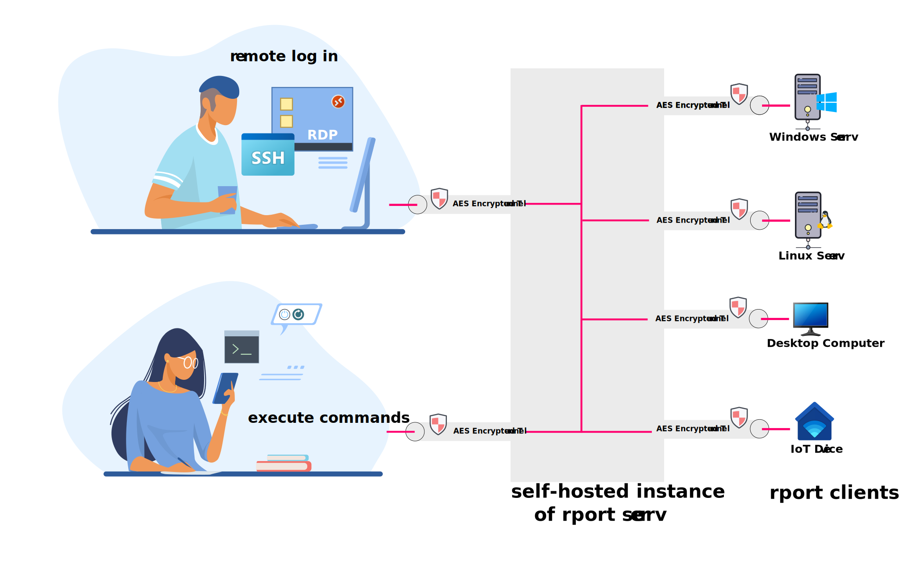

# rport
Create reverse tunnels with ease.

## At a glance
Rport helps you to manage your remote servers without the hassle of VPNs, chained SSH connections, jump-hosts, or the use of commercial tools like TeamViewer and its clones.

Rport acts as server and client establishing permanent or on-demand secure tunnels to devices inside protected intranets behind a firewall.

All operating systems provide secure and well-established mechanisms for remote management, being SSH and Remote Desktop the most widely used. Rport makes them accessible easily and securely.

**Is Rport a replacement for TeamViewer?**
Yes and no. It depends on your needs.
TeamViewer and a couple of similar products are focused on giving access to a remote graphical desktop bypassing the Remote Desktop implementation of Microsoft. They fall short in a heterogeneous environment where access to headless Linux machines is needed. But they are without alternatives for Windows Home Editions.
Apart from remote management, they offer supplementary services like Video Conferences, desktop sharing, screen mirroring, or spontaneous remote assistance for desktop users.

**Goal of Rport**
Rport focuses only on remote management of those operating systems where an existing login mechanism can be used. It can be used for Linux and Windows, but also appliances and IoT devices providing a web-based configuration.
From a technological perspective, [Ngrok](https://ngrok.com/) and [openport.io](https://openport.io) are similar products. Rport differs from them in many aspects.
* Rport is 100% open source. Client and Server. Remote management is a matter of trust and security. Rport is fully transparent.
* Rport comes with a user interface making the management of remote systems easy and user-friendly.
* Rport is made for all operating systems with native and small binaries. No need for Python or similar heavyweights.
* Rport allows you to self-host the server.
* Rport allows clients to wait in standby mode without an active tunnel. Tunnels can be requested on-demand by the user remotely.

**Supported operating systems**
For the client almost all operating systems are supported and we provide binaries for a variety of Linux architectures and Microsoft Windows.
Also, the server can run on any operation system supported by the golang compiler. At the moment we provide server binaries only for Linux X64 because this is the ideal platform for running it securely and cost effective. 



## Table of Contents
* [Build and installation](#build-install)
* [Usage](#usage)
* [Feedback and Help](#feedback)
* [Quickstart guide](#quick-guide)
  * [Run the rport server without installation](#run-server)
  * [Install and run the rport server](#install-server)
  * [Run the server with systemd](#run-server-systemd)
  * [Connect a client](#run-client)
  * [Run a Linux client with systemd](#linux-client-systemd)
  * [Run a Windows client](#windows-client)
  * [Run clients on other operating systems](#other-clients)
  * [Configuration files](#configs) 
  * [Using authentication](#client-auth)
* [On-demand tunnels using the API](#on-demand-tunnels)
  * [Activate the API](#api-activate)
  * [Connect a client without a tunnel](#client-no-tunnel)
  * [Manage clients and tunnels through the API](#manage-clients)
* [All API capabilities](#api-capabilities)
* [Install a web-based frontend](#install-frontend)
* [Install the command-line interface](#cli)
* [Versioning model](#versioning)
* [Credits](#credits)

<a name="build-install"></a>
## Build and installation
1) We provide [pre-compiled binaries](https://github.com/cloudradar-monitoring/rport/releases).

2) From source:
    * Build from source (Linux or Mac OS/X):
    ```bash
    make all
    ```
    `rport` and `rportd` binaries will appear in directory.

    * Build using Docker:
    ```bash
    make docker-goreleaser
    ```
    will create binaries for all supported platforms in `./dist` directory.

<a name="usage"></a>
## Usage
`rportd` should be executed on the machine, acting as a server.

`rport` is a client app which will try to establish long-running connection to the server.

Minimal setup:
1) Execute `./rportd --addr 0.0.0.0:9999 --auth rport:password123 --data-dir /var/tmp` on a server.
1) Execute `./rport --auth rport:password123 <SERVER_IP>:9999 2222:22` on a client or `./rport --auth rport:password123 <SERVER_IP>:9999 22` and the server tunnel port will be randomly chosen for you.
1) Now end-users can connect to `<SERVER_IP>:2222` (e.g. using a SSH Connection). The connection will be proxied to client machine.

See `./rportd --help` and `./rport --help` for more options, like:
- Specifying certificate fingerprint to validate server authority
- Restricting, which users can connect
- Specifying additional intermediate HTTP proxy
- Using POSIX signals to control running apps
- Setting custom HTTP headers
- Using IPv6 addresses when starting a server

<a name="feedback"></a>
## Feedback and Help
**We need your feedback**.
Our vision is to establish Rport as a serious alternative to all the black box software for remote management. To make it a success, please share your feedback. 
### Report bugs
If you encounter errors while installing or using Rport, please let us know. [File an issue report](https://github.com/cloudradar-monitoring/rport/issues) here on Github.
### Ask question
If you have difficulties installing or using rport, don't hesitate to ask us anything. Often questions give us a hint on how to improve the documentation. Do not use issue reports for asking questions. Use the [discussion forum](https://github.com/cloudradar-monitoring/rport/discussions) instead. 
### Positive Feedback
Please share positive feedback also. Give us a star. Write a review. Share our project page on your social media. Contribute to the [discussion](https://github.com/cloudradar-monitoring/rport/discussions). Is Rport suitable for your needs? What is missing?

<a name="quick-guide"></a>
## Quickstart guide
<a name="run-server"></a>
### Run the server without installation
If you quickly want to run the rport server without installation, run the following commands from any unprivileged user account.
```
wget https://github.com/cloudradar-monitoring/rport/releases/download/0.1.29/rport_0.1.29_Linux_x86_64.tar.gz
sudo tar vxzf rport_0.1.29_Linux_x86_64.tar.gz rportd
KEY=$(openssl rand -hex 18)
./rportd --log-level info --data-dir /var/tmp/ --key $KEY --auth clientAuth1:1234
```
Rportd will be listening on the default port 8080 for client connections. 
Grab the generated fingerprint from `/var/tmp/rportd-fingerprint.txt` and use it for secure client connections. 
<a name="install-server"></a>

### Install and run the rport server

On a machine connected to the public internet and ideally with an FQDN registered to a public DNS install and run the server.
Assume, the server is called `node1.example.com`.

#### A note on security
> **Do not run the server as root!** This is an unnecessary risk. Rportd should always use an unprivileged user.
>
>While using rport without a **fingerprint** is possible, it's highly recommended to not skip this part.
The fingerprint ensures you connect only to trusted servers. If you omit this step a man in the middle can bring up a rport server and hijack your tunnels.
If you do ssh or rdp through the tunnel, a hijacked tunnel will not expose your credentials because the data inside the tunnel is still encrypted. But if you use rport for unencrypted protocols like HTTP, sniffing credentials would be possible.
>
>You might wonder why the rport server does not provide encryption on the transport layer (TLS, SSL, HTTPS). **Encryption is always enabled.** Your connections are encrypted and secured by SSH over HTTP. When you start up the rport server, it will generate an in-memory ECDSA public/private key pair. Adding TLS by putting a SSL [reverse proxy](./docs/reverse-proxy.md) is possible so you get SSH over HTTPS.

#### Install the server
For a proper installation execute the following steps.
```
wget https://github.com/cloudradar-monitoring/rport/releases/download/0.1.29/rport_0.1.29_Linux_x86_64.tar.gz
sudo tar vxzf rport_0.1.29_Linux_x86_64.tar.gz -C /usr/local/bin/ rportd
sudo useradd -d /var/lib/rport -m -U -r -s /bin/false rport
sudo mkdir /etc/rport/
sudo mkdir /var/log/rport/
sudo chown rport /var/log/rport/
sudo tar vxzf rport_0.1.29_Linux_x86_64.tar.gz -C /etc/rport/ rportd.example.conf
sudo cp /etc/rport/rportd.example.conf /etc/rport/rportd.conf
```

Create a key for the server instance. Store this key and don't change it. You will use it later. Otherwise, your fingerprint will change and your clients might be rejected.
```
openssl rand -hex 18
```

Open the `/etc/rport/rportd.conf` with an editor. Add the generated random string as `key_seed`. All other default settings are suitable for a quick and secure start.

Change to the rport user account and check your rportd starts without errors.
```
ubuntu@node1:~$ sudo -u rport -s /bin/bash
rport@node1:/home/ubuntu$ rportd -c /etc/rport/rportd.conf --log-level info &
```
For the first testing leave the console open and observe the log with `tail -f /var/log/rport/rportd.log`. Copy the generated fingerprint from `/var/lib/rport/rportd-fingerprint.txt` to your clipboard. Try your first client connection now.

<a name="run-server-systemd"></a>
### Run the server with systemd
If all works fine stop the rport server and integrate it into systemd.
```
sudo rportd --service install --service-user rport --config /etc/rport/rportd.conf
```
A file `/etc/systemd/system/rportd.service` will be created and systemd is ready to manage rportd.
```
sudo systemctl start rportd
sudo systemctl enable rportd # Optionally start rportd on boot
```

<a name="run-client"></a>
### Connect a client
Assume, the client is called `client1.local.localdomain`.
On your client just install the client binary
```
curl -LSs https://github.com/cloudradar-monitoring/rport/releases/download/0.1.29/rport_0.1.29_Linux_x86_64.tar.gz|\
tar vxzf - -C /usr/local/bin/ rport
```

Create an ad hoc tunnel that will forward the port 2222 of `node1.example.com` to the to local port 22 of `client1.local.localdomain`.
```
rport --auth clientAuth1:1234 --fingerprint <YOUR_FINGERPRINT> node1.example.com:8080 2222:0.0.0.0:22
```
Observing the log of the server you get a confirmation about the newly created tunnel.

Now you can access your machine behind a firewall through the tunnel. Try `ssh -p 2222 node1.example.com` and you will come out on the machine where the tunnel has been initiated.

<a name="linux-client-systemd"></a>
### Run a Linux client with systemd
For a proper and permanent installation of the client execute the following steps.
```
wget https://github.com/cloudradar-monitoring/rport/releases/download/0.1.29/rport_0.1.29_Linux_x86_64.tar.gz
sudo tar vxzf rport_0.1.29_Linux_x86_64.tar.gz -C /usr/local/bin/ rport
sudo useradd -d /var/lib/rport -U -m -r -s /bin/false rport
sudo mkdir /etc/rport/
sudo mkdir /var/log/rport/
sudo chown rport /var/log/rport/
sudo tar vxzf rport_0.1.29_Linux_x86_64.tar.gz -C /etc/rport/ rport.example.conf
sudo cp /etc/rport/rport.example.conf /etc/rport/rport.conf
sudo rport --service install --service-user rport --config /etc/rport/rport.conf
```
Open the config file `/etc/rport/rport.conf` and adjust it to your needs. (See below.)
Finally, start the rport client and optionally register it in the auto-start.
```
systemctl start rport
systemctl enable rport
```

A very minimalistic client configuration `rport.conf` can look like this:
```
[client]
server = "node1.example.com:8080"
fingerprint = "<YOUR_FINGERPRINT>"
auth = "clientAuth1:1234"
remotes = ['2222:22']
```
This will establish a permanent tunnel and the local port 22 (SSH) of the client becomes available on port 2222 of the rport server.

<a name="windows-client"></a>
### Run a Windows client
On Microsoft Windows [download the latest client binary](https://github.com/cloudradar-monitoring/rport/releases/download/0.1.29/rport_0.1.29_Windows_x86_64.zip) and extract it ideally to `C:\Program Files\rport`. Rename the `rport.example.conf` to `rport.conf` and store it in `C:\Program Files\rport` too.
Open the `rport.conf` file with a text editor. On older Windows use an editor that supports unix line breaks, like [notepad++](https://notepad-plus-plus.org/).

A very minimalistic client configuration `rport.conf` can look like this:
```
[client]
server = "node1.example.com:8080"
fingerprint = "<YOUR_FINGERPRINT>"
auth = "clientAuth1:1234"
remotes = ['3300:3389']
```
This will establish a permanent tunnel and the local port 3389 (remote desktop) of the client becomes available on port 3300 of the rport server.

Before registering rport as a windows service, check your connection manually.

Open a command prompt with administrative rights and type in:
```
cd "C:\Program Files\rport"
rport.exe -c rport.conf
```
If you don't get errors on the console, try a remote desktop connection to the rport server on port 3300.
Stop the client with CTRL-C and register it as a service and start it.

```
rport.exe --service install -c rport.conf
sc query rport
sc start rport
```

The windows service will be created with "Startup type = automatic". If you don't want the rport client to start on boot, you must manually disable it using for example `sc config rport start=disabled`. 

<a name="other-clients"></a>
### Run clients on other operating systems
Please refer to [clients on other operating systems](./docs/client-on-other-os.md).

<a name="configs"></a>
### Configuration files
Config files can be used to set up both the rport server and clients.
In order to start `rportd`/`rport` with settings from a config file an arg `--config`(or `-c`) should be passed to a command with a path to the file, for example:
```
rportd -c /etc/rport/rportd.conf
```
```
rport -c /etc/rport/rport.conf
```
Configuration examples `rportd.example.conf` ([view online](rportd.example.conf)) and `rport.example.conf` ([view online](rport.example.conf)) can be found in the release archive or in the source.

NOTE:
* command arguments and env variables will override values from a config file.
* to apply any changes to a configuration file `rportd` or `rport` should be restarted.

<a name="client-auth"></a>
### Using authentication
To prevent anyone who knows the address and the port of your rport server to use it for tunneling, using client authentication is required.

Using a static client authentication credentials is the most basic option. See the comments in the [rportd.example.conf](rportd.example.conf) and read more about all supported [authentication options](docs/client-auth.md).

On the client start the tunnel this way
```
rport --auth clientAuth1:1234 --fingerprint <YOUR_FINGERPRINT> node1.example.com:8080 2222:0.0.0.0:22
```
*Note that in this early version the order of the command line options is still important. This might change later.*


<a name="on-demand-tunnels"></a>
## On-demand tunnels using the API
Initializing the creation of a tunnel from the client is nice but not a perfect solution for secure and reliable remote access to a large number of machines.
Most of the time the tunnel wouldn't be used. Network resources would be wasted and a port is exposed to the internet for an unnecessarily long time.
Rport provides the option to establish tunnels from the server only when you need them.

<a name="api-activate"></a>
### Activate the API
Using the provided `rportd.example.conf` the internal management API is enabled by default listening on http://localhost:3000.

Set up `[api]` config params. For example:
   ```
   # specify non-empty api.address to enable API support
   [api]
     # Defines the IP address and port the API server listens on
     address = "127.0.0.1:3000"
     # Defines <user:password> authentication pair for accessing API
     auth = "admin:foobaz"
     jwt_secret = "quei1too2Jae3xootu"
   ```
This opens the API and enables HTTP basic authentication with a single user "admin:foobaz" who has access to the API.
Restart the rportd after any changes to the configuration. Read more about API [authentication options](./docs/api-auth.md).

**Caution:** Do not run the API on public servers with the default credentials. Change the `auth=` settings and generate your own `jwt_secret` using for example the command `pwgen 24 1` or `openssl rand -hex 12`. 

If you expose your API to the public internet, it's highly recommended to enable HTTPS. Read the [quick HTTPS howto](./docs/https-howto.md).

Test you've set up the API properly by querying its status with `curl -s -u admin:foobaz http://localhost:3000/api/v1/status`.

> The API always returns a minified json formatted response. The large output is hard to read. In all further examples, we use the command-line tool [jq](https://stedolan.github.io/jq/) to reformat the json with line breaks and indentation for better readability. `jq`is included in almost any distribution, for Windows you can download it [here](https://stedolan.github.io/jq/download/).

Example of a human readable API status
```
~# curl -s -u admin:foobaz http://localhost:3000/api/v1/status |jq
{
  "data": {
    "connect_url": "http://0.0.0.0:8080",
    "fingerprint": "2a:c8:79:09:80:ba:7c:60:05:e5:2c:99:6d:75:56:24",
    "clients_connected": 3,
    "clients_disconnected": 1,
    "version": "0.1.29"
  }
}
```

<a name="client-no-tunnel"></a>
### Connect a client without a tunnel
Invoke the rport client without specifying a tunnel but with some extra data.
```
rport --id my-client-1 \
  --fingerprint <YOUR_FINGERPRINT> \
  --tag Linux --tag "Office Berlin" \
  --name "My Test VM" --auth clientAuth1:1234 \
  node1.example.com:8080
```
*Add auth and fingerprint as already explained.*

This attaches the client to the message queue of the server without creating a tunnel.

<a name="manage-clients"></a>
### Manage clients and tunnels through the API
On the server, you can supervise the attached clients using
`curl -s -u admin:foobaz http://localhost:3000/api/v1/clients`.
Here is an example:
```
curl -s -u admin:foobaz http://localhost:3000/api/v1/clients|jq
[
  {
    "id": "my-client-1",
    "name": "My Test VM",
    "os": "Linux my-devvm-v3 5.4.0-37-generic #41-Ubuntu SMP Wed Jun 3 18:57:02 UTC 2020 x86_64 x86_64 x86_64 GNU/Linux",
    "os_arch": "amd64",
    "os_family": "debian",
    "os_kernel": "linux",
    "hostname": "my-devvm-v3",
    "ipv4": [
      "192.168.3.148"
    ],
    "ipv6": [
      "fe80::20c:29ff:fec8:b1f"
    ],
    "tags": [
      "Linux",
      "Office Berlin"
    ],
    "version": "0.1.6",
    "address": "87.123.136.***:63552",
    "tunnels": []
  },
   {
    "id": "aa1210c7-1899-491e-8e71-564cacaf1df8",
    "name": "Random Rport Client",
    "os": "Linux alpine-3-10-tk-01 4.19.80-0-virt #1-Alpine SMP Fri Oct 18 11:51:24 UTC 2019 x86_64 Linux",
    "os_arch": "amd64",
    "os_family": "alpine",
    "os_kernel": "linux",
    "hostname": "alpine-3-10-tk-01",
    "ipv4": [
      "192.168.122.117"
    ],
    "ipv6": [
      "fe80::b84f:aff:fe59:a0ba"
    ],
    "tags": [
      "Linux",
      "Datacenter 1"
    ],
    "version": "0.1.6",
    "address": "88.198.189.***:43206",
    "tunnels": [
      {
        "lhost": "0.0.0.0",
        "lport": "2222",
        "rhost": "0.0.0.0",
        "rport": "22",
        "id": "1"
      }
    ]
  }
]
```
There is one client connected with an active tunnel. The second client is in standby mode.
Read more about the [management of tunnel via the API](docs/managing-tunnels.md) or read the [Swagger API docs](https://petstore.swagger.io/?url=https://raw.githubusercontent.com/cloudradar-monitoring/rport/master/api-doc.yml).

<a name="api-capabilities"></a>
## All API Capabilities
* [Swagger API docs](https://petstore.swagger.io/?url=https://raw.githubusercontent.com/cloudradar-monitoring/rport/master/api-doc.yml).
* [API authentication options](docs/api-auth.md)
* [Management of clients and tunnels via the API](docs/managing-tunnels.md) or the [Swagger API docs](https://petstore.swagger.io/?url=https://raw.githubusercontent.com/cloudradar-monitoring/rport/master/api-doc.yml#/Clients%20and%20Tunnels)
* [Command execution via the API](docs/command-execution.md) or the [Swagger API docs](https://petstore.swagger.io/?url=https://raw.githubusercontent.com/cloudradar-monitoring/rport/master/api-doc.yml#/Commands)
* [Management of client authentication credentials via the API](docs/client-auth.md) or the [Swagger API docs](https://petstore.swagger.io/?url=https://raw.githubusercontent.com/cloudradar-monitoring/rport/master/api-doc.yml#/Rport%20Client%20Auth%20Credentials)
* [Management of client groups via the API](docs/client-groups.md) or the [Swagger API docs](https://petstore.swagger.io/?url=https://raw.githubusercontent.com/cloudradar-monitoring/rport/master/api-doc.yml#/Client%20Groups)

<a name="install-frontend"></a>
## Install a web-based frontend
Rport comes with a user-friendly web-based frontend. The frontend has it's own none-open-source repository. The installation is quick and easy. [Learn more](docs/frontend.md).

<a name="cli"></a>
## Install the command-line interface
You can also manage clients, tunnels, and commandd from a user-friendly command-line utility. It's available as a stand-alone static binary for Windows and Linux. See [https://github.com/cloudradar-monitoring/rportcli](https://github.com/cloudradar-monitoring/rportcli). The command-line utility does not cover all API capabilities yet. But it's already a very useful tool making rport even more powerful.

<a name="versioning"></a>
## Versioning model
rport uses `<major>.<minor>.<buildnumber>` version pattern for compatibility with a maximum number of package managers.

Starting from version 1.0.0 packages with even <minor> number are considered stable.

<a name="credits"></a>
## Credits
* Forked from [jpillora/chisel](https://github.com/jpillora/chisel)
* Image by [pch.vector / Freepik](http://www.freepik.com)
